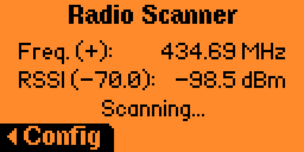
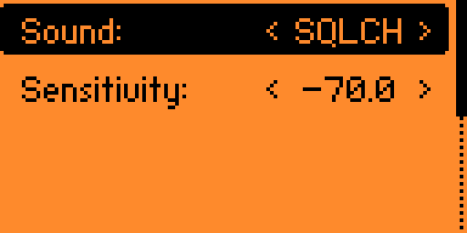

# Flipper-Zero-Radio-Scanner

## 📻 Description
Scans frequencies available to the CC1101 and plays them over the speaker so you can hear them.
- Does NOT play "FM radio stations" since those frequencies are not available.

## 📸 Screenshots

## 🤔 ToDo
- Currently using FM238 (FuriHalSubGhzPreset2FSKDev238Async) but per CodeAllNight a custom preset can be used to improve audio.

